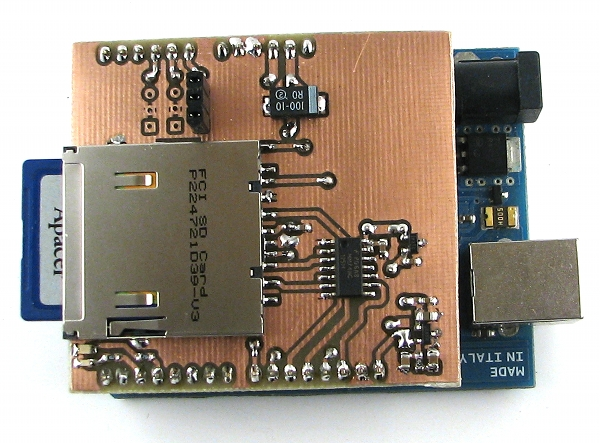

ArduinoDataloggerShield
=======================

SD card datalogger shield for Arduino with two external voltage references. 

I've made this shield because there were no designs in the wild employing external references - this is usefull feature to have when logging analog voltages.

Features: 
 * 74hc125 buffer for level translation
 * 1.20V voltage reference selectable via solder jumper
 * 2.5V voltage reference selectable via solder jumper
 * red indication led
 * green indication led
 * SD card detection
 * SD card write protection detection 

